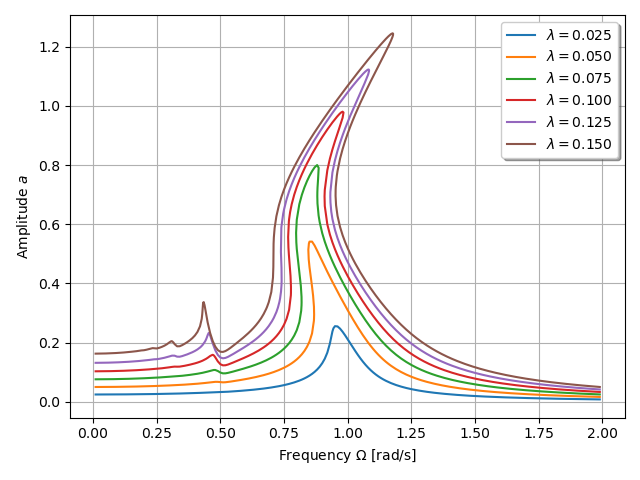
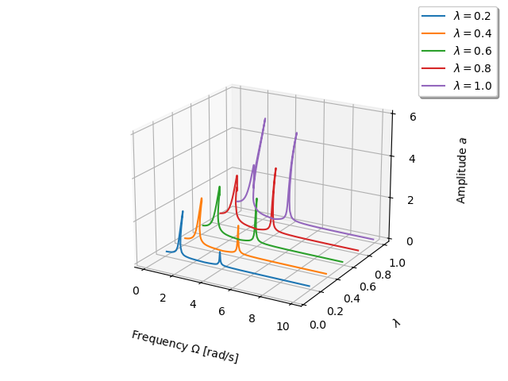

The example is taken from [Tracking Amplitude Extrema of Nonlinear Frequency Responses using the Harmonic Balance Method](https://doi.org/10.1002/nme.7376)

$$m \ddot{x} + c\dot{x} + k x + k_2 x^2 + k_3 x^3 = \lambda \sin(\Omega t)$$

