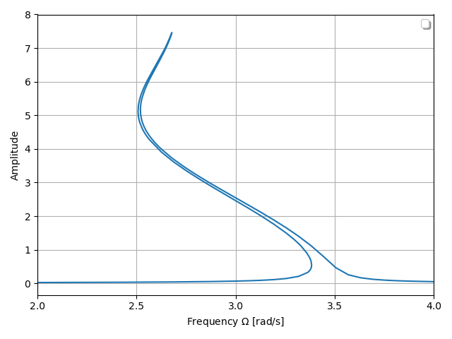

***
[⬅️](../009/README.md "Previous example")
[➡️](../011/README.md "Next example")
***

The example is taken from [A novel adaptive harmonic balance method with an asymptotic harmonic selection](https://doi.org/10.1007/s10483-023-3047-6)

