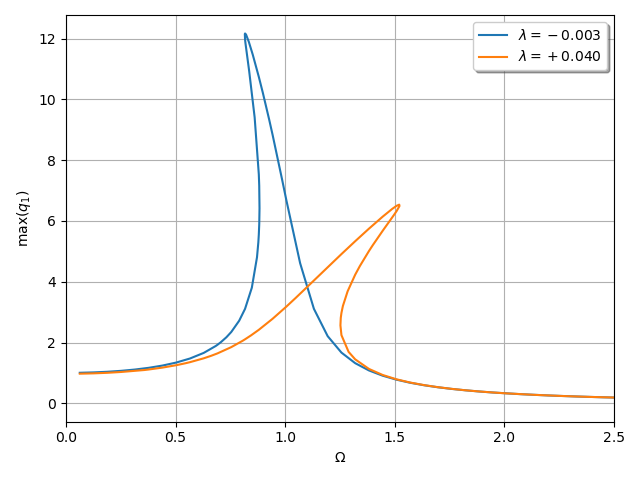

The example is adapted from [A time and ensemble equivalent linearization method for nonlinear systems under combined harmonic and random excitation](https://doi.org/10.1177/09544062231203844)

$$\ddot{u} + 2\xi\omega_n \dot{u} + \omega_n^2 u + \lambda u^3 = f \cos(\Omega t)$$
