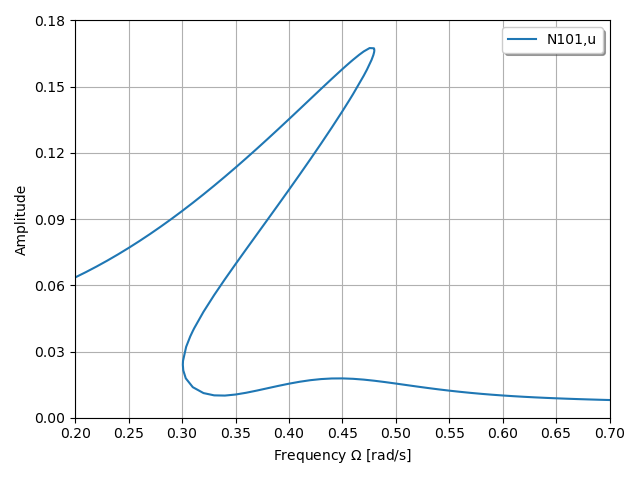

The example is adapted from [A general and efficient harmonic balance method for nonlinear dynamic simulation](https://doi.org/10.1016/j.ijmecsci.2024.109388)

$$u_{RMS} = \sqrt{ u_0^2 + \frac{1}{2} \sum\limits_{k=1}^H ( u_{c,k}^2+u_{s,k}^2) }$$
