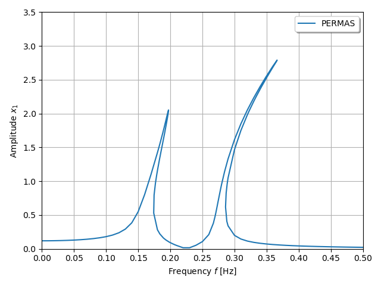

***
[⬅️](../029/README.md "Previous example")
[➡️](../031/README.md "Next example")
***

The example is adapted from [Nonlinear frequency response analysis using MSC Nastran](https://doi.org/10.1002/nme.7588)

