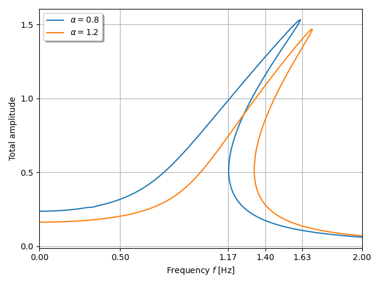

***
[⬅️](../030/README.md "Previous example")
[➡️](../032/README.md "Next example")
***

The example is adapted from [Uncertainty Analysis of Limit Cycle Oscillations in Nonlinear Dynamical Systems with the Fourier Generalized Polynomial Chaos Expansion](http://dx.doi.org/10.48550/arXiv.2409.11006)

