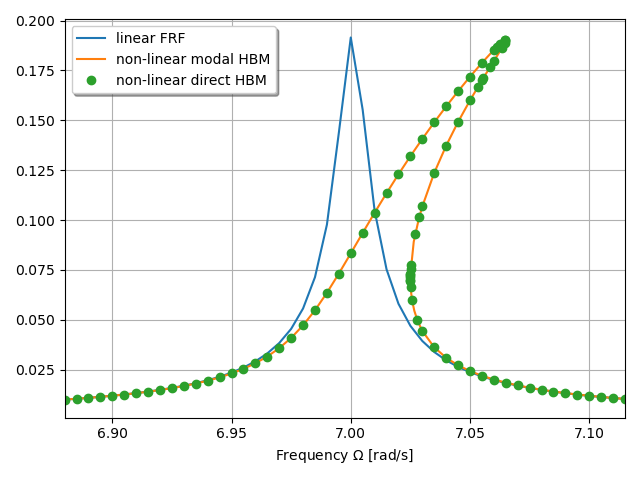

***
[⬅️](../035/README.md "Previous example")
[➡️](../037/README.md "Next example")
***

The example is adapted from [Model reduction to spectral submanifolds and forced-response calculation in high-dimensional mechanical systems](https://doi.org/10.1016/j.jsv.2020.115640)

