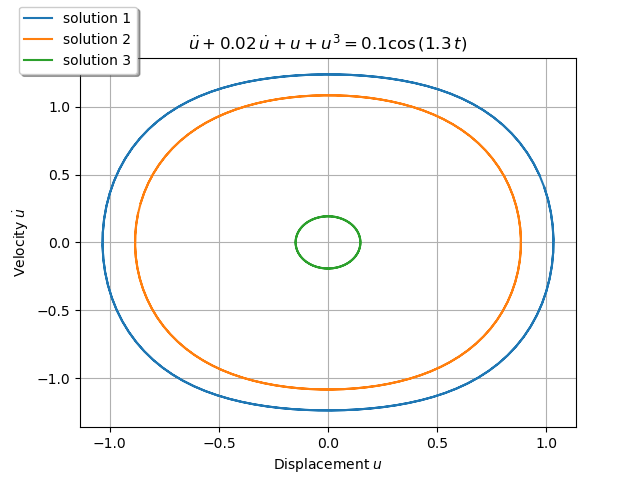

The example is adapted from [Learning global linear representations of nonlinear dynamics](https://doi.org/10.1007/s11071-024-10843-0)

Thanks to Thomas Breunung for sharing his research. His support is greatly appreciated.

