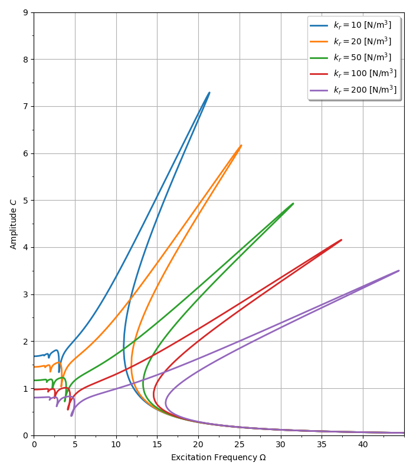
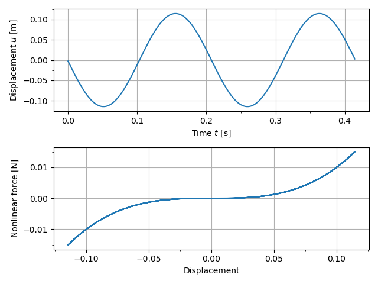
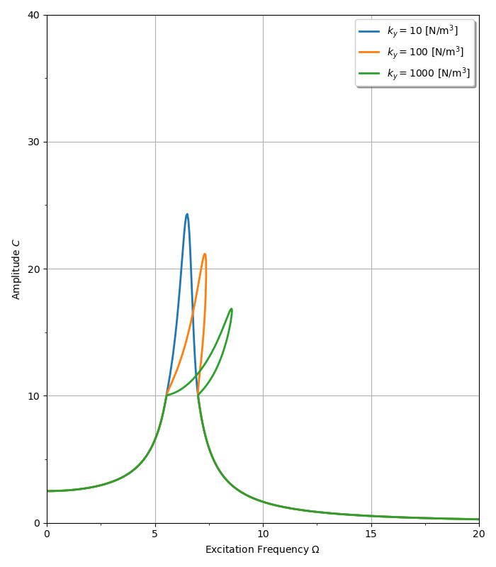
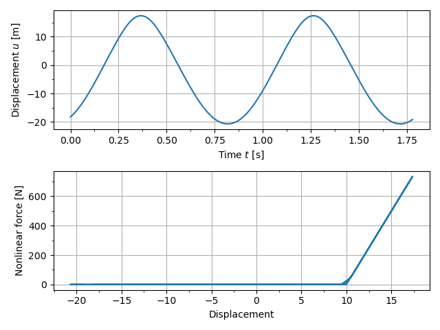

The example is adapted from [Local Sensitivity Analysis of Steady-State Response of Rotors with Rub-Impact to Parameters of Rubbing Interfaces](https://doi.org/10.3390/app11031307)

## Duffing oscillator

## Gap model

