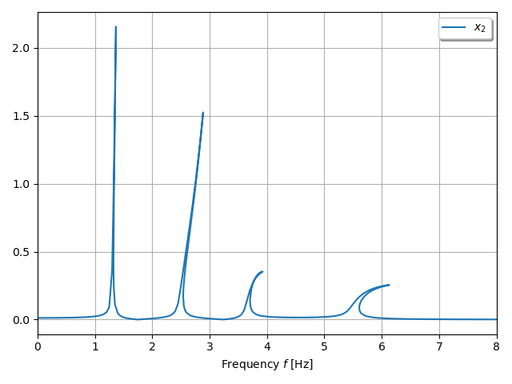

***
[⬅️](../057/README.md "Previous example")
[➡️](../README.md "Go up one directory level")
***

The example is adapted from [Localization and identification of structural nonlinearities using cascaded optimization and neural networks](https://doi.org/10.1016/j.ymssp.2017.03.030)

