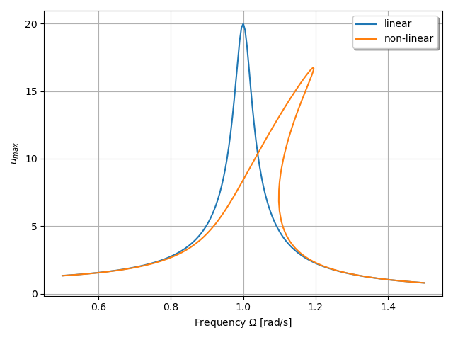

***
[⬅️](../062/README.md "Previous example")
[➡️](../README.md "Go up one directory level")
***

The example is adapted from [Space-time finite element path-following for periodic solutions in nonlinear vibration problems](https://doi.org/10.1016/j.cma.2026.118848)

