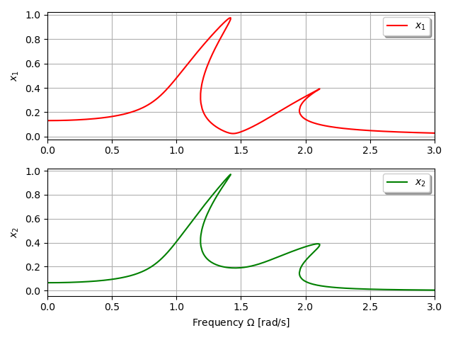

***
[⬅️](../064/README.md "Previous example")
[➡️](../README.md "Go up one directory level")
***

The example is adapted from a project report provided by Nedimcan Aytemür. His support is greatly appreciated.

