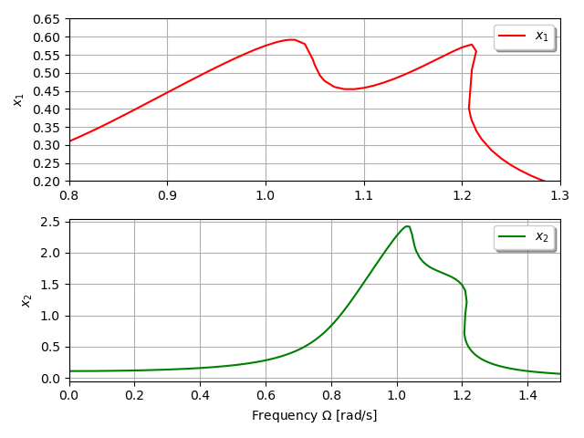

***
[⬅️](../064/README.md "Previous example")
[➡️](../066/README.md "Next example")
***

The examples are adapted from a project report provided by Nedimcan Aytemür. His support is greatly appreciated.

### Present Study

### Reference Studxy

