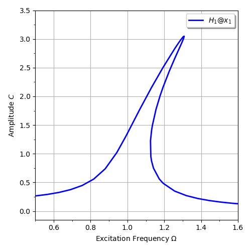

***
[⬅️](../067/README.md "Previous example")
[➡️](../README.md "Go up one directory level")
***

The example is taken from [Continuation-Enhanced Harmonic Balance Method for Nonlinear Dynamics in Rotating Machinery](https://doi.org/10.1155/vib/2429386)

