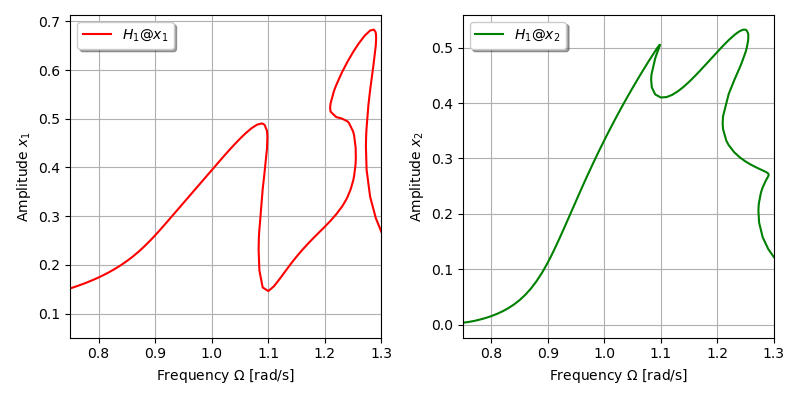

***
[⬅️](../068/README.md "Previous example")
[➡️](../README.md "Go up one directory level")
***

The example is adapted from [Locating isolas in nonlinear oscillator systems using uncertainty quantification](https://doi.org/10.1098/rspa.2025.0939)

