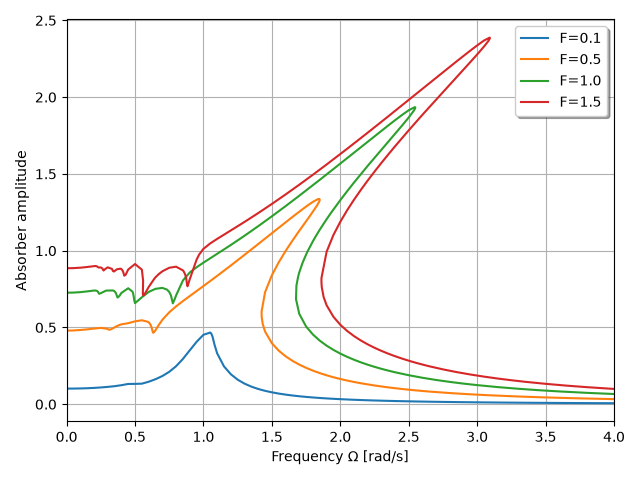

***
[⬅️](../070/README.md "Previous example")
[➡️](../README.md "Go up one directory level")
***

The example is adapted from [Nonlinear Dynamics and Vibration Suppression of a Helmholtz–Duffing Absorber](https://doi.org/10.1016/j.jsv.2026.120009)

