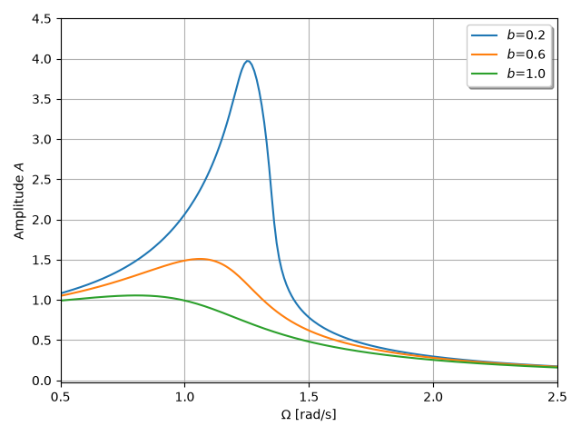

***
[⬅️](../072/README.md "Previous example")
[➡️](../README.md "Go up one directory level")
***

The example is adapted from [Nonlinear Dynamics of Forced and Damped Oscillators with Hertzian Contact Interaction](https://doi.org/10.1007/s42417-026-02762-8)
Thanks to Stylianos Vasileios Kontomaris for private communication.

The terms $\frac{4}{3}k \vert{}\xi\vert{}^{\frac{1}{2}}\xi$ and $-\frac{4}{30}k \vert{}\xi\vert{}^{\frac{3}{2}}\xi$ exhibit non-differentiability at $\xi = 0$ due to the fractional powers and absolute value functions, which can cause convergence issues or numerical instability in solvers.

Introduce a small positive parameter $\epsilon > 0$ (e.g., $\epsilon = 10^{-6}$) to smooth out the non-differentiable point 
at the origin: $\vert{}\xi\vert{} \approx \sqrt{\xi^2 + \epsilon}$ 

Replacing $\vert{}\xi\vert{}$ in both terms yields:
2nd Term: $\frac{4}{3}k \left(\xi^2 + \epsilon\right)^{\frac{1}{4}} \xi$
3rd Term: $-\frac{4}{30}k \left(\xi^2 + \epsilon\right)^{\frac{3}{4}} \xi$

