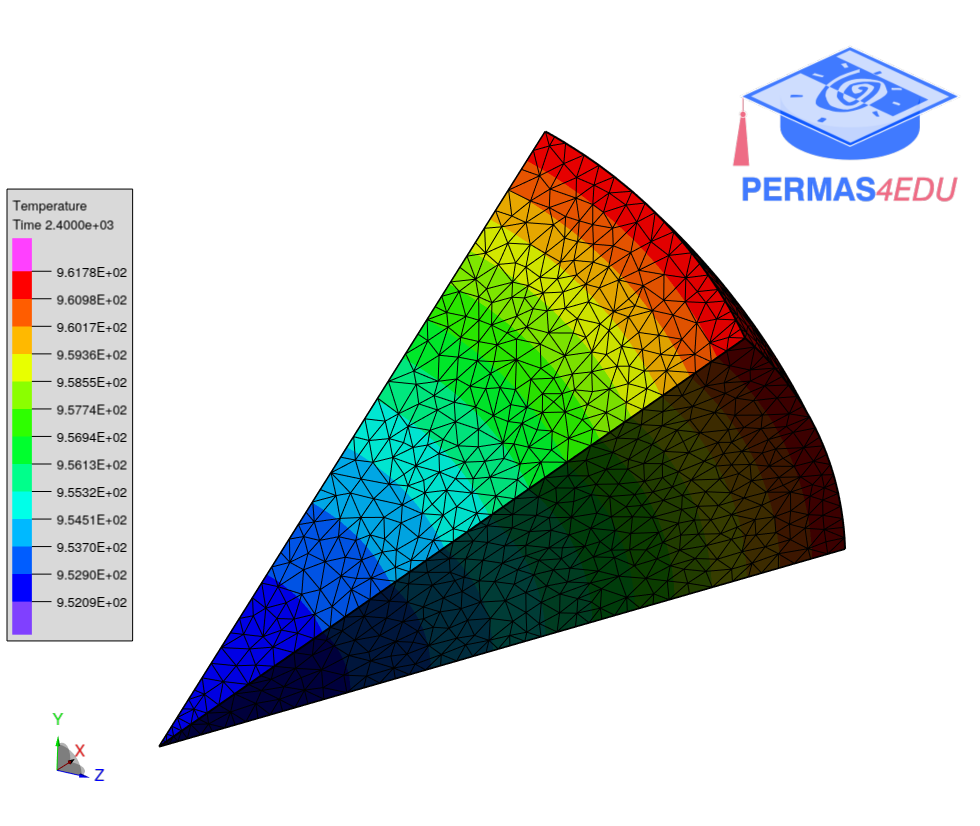

***
[⬅️](../README.md "Go up one directory level")
[➡️](../002/README.md "Next example")
***

The example is taken from [Heat transfer of a sphere under convection](https://www.simscale.com/docs/validation-cases/heat-transfer-of-a-sphere-under-convection/)

 
