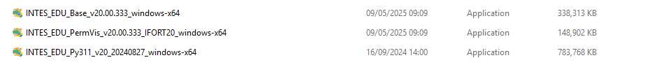
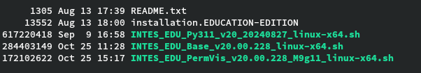
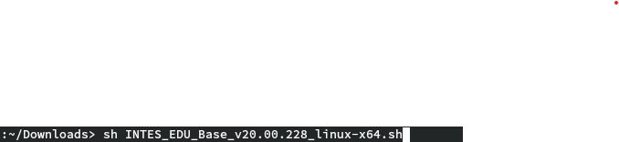
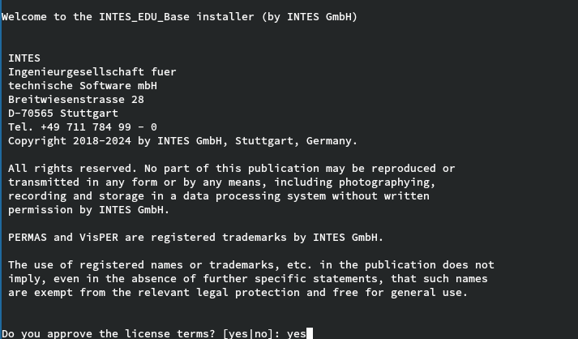
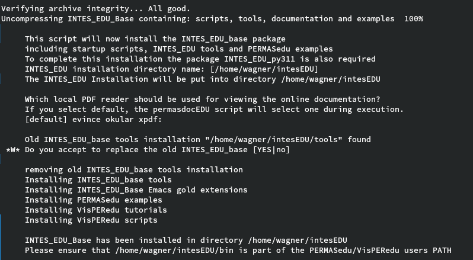
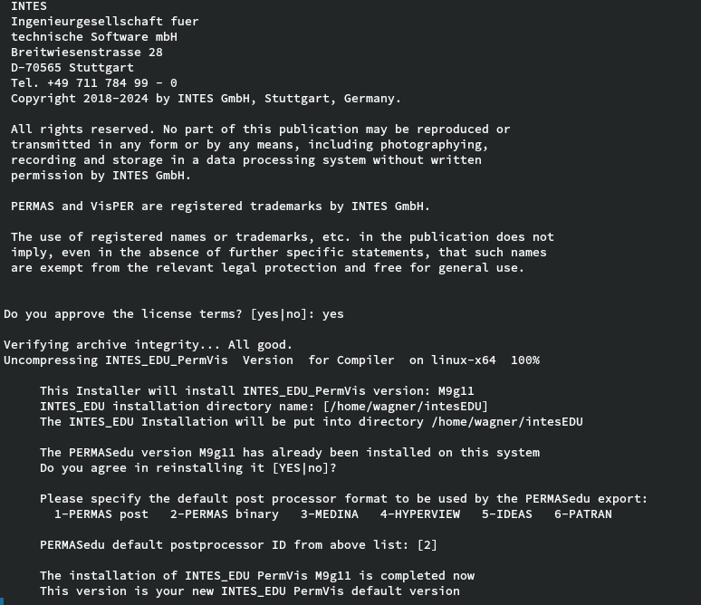
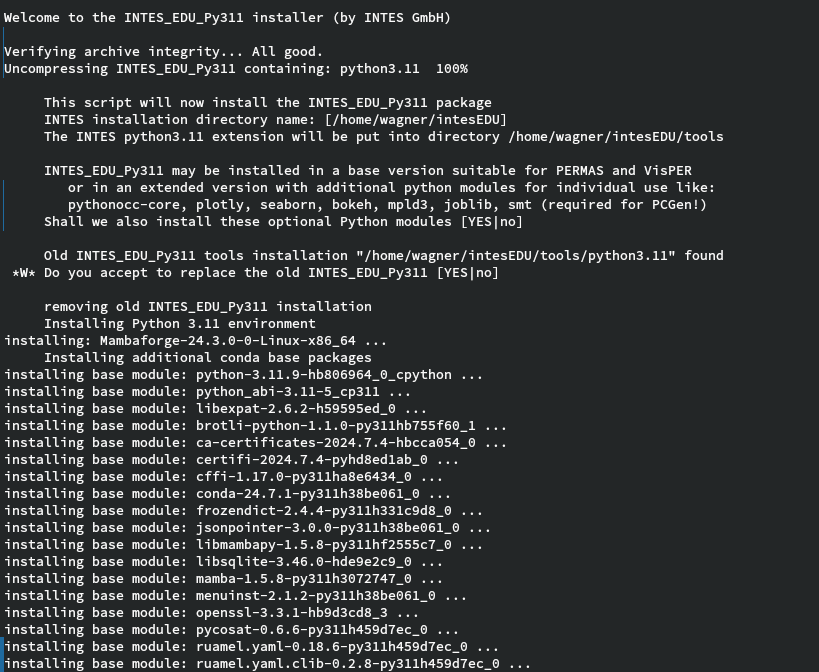
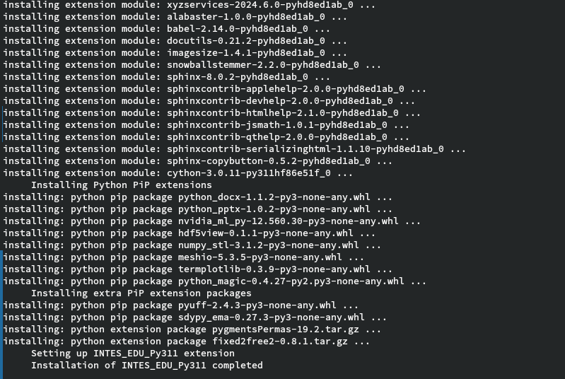

# Windows

### Registration

PERMAS4EDU can be obtained through [Registration](https://www.intes.de/k_permas/overview/academic_license)

### Download 
The following link will lead you directly to the software download:
[User forum](https://meet.intes.de:444/)

### Required Files

Before you start the installation process, make sure that the following files are available on the computer.

A new bugfix release is available, i.e. 

Double-click on the Base Installer to start the installation.

### License Agreement

### License file

Select the license file that you received via email.

### Solver settings

Ensure that you have write permissions in the scratch directory!
The settings are stored in the configuration file PERMAS.DFT. For Windows users, the file can be found by default at C:\Program Files\INTES\EDU\PermVis\M9v20\etc.
A local copy can be located in the home directory or in the current working directory. If there is a copy in the working directory, it will be used as the default.

### pyINTES License Agreement

### Additional Python modules

### Installation completed

$$\textrm{\color{red}{The installation process is completed after approx. 20 minutes.}}$$ Thank you for your patience.

# Linux

### Registration

PERMAS4EDU can be obtained through [Registration](https://www.intes.de/k_permas/overview/academic_license)

### Download 
The following link will lead you directly to the software download:
[User forum](https://meet.intes.de:444/)

### Required Files

Before you start the installation process, make sure that the following files are available on the computer.

### Shell Scripts

