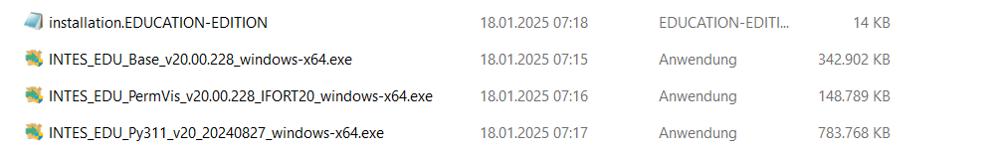
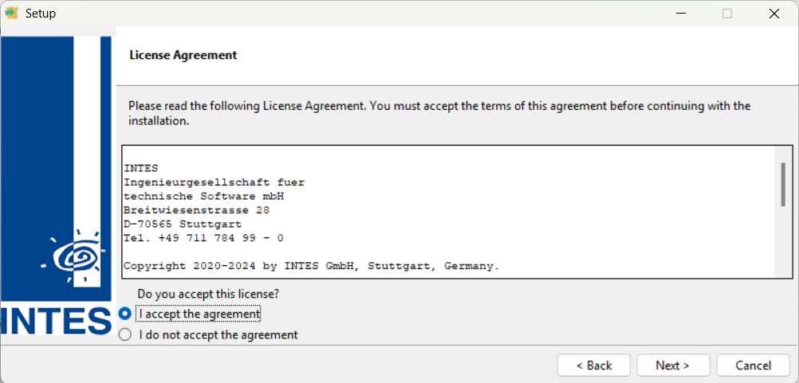
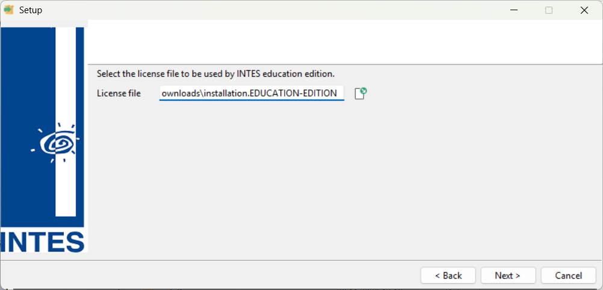
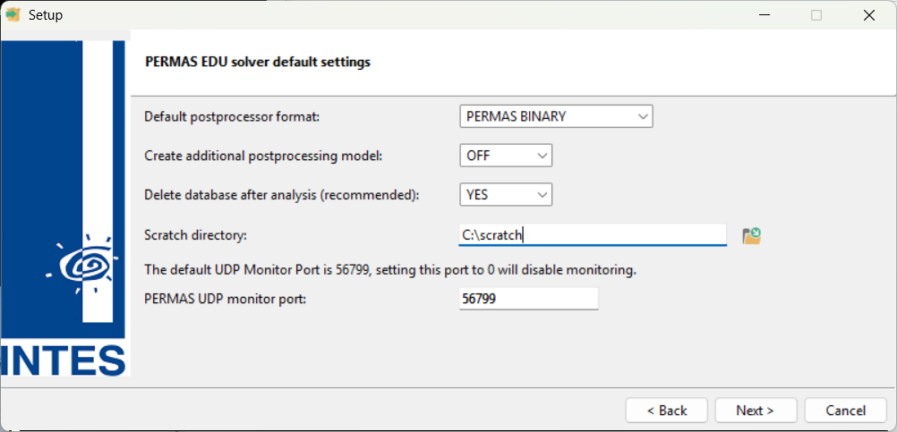
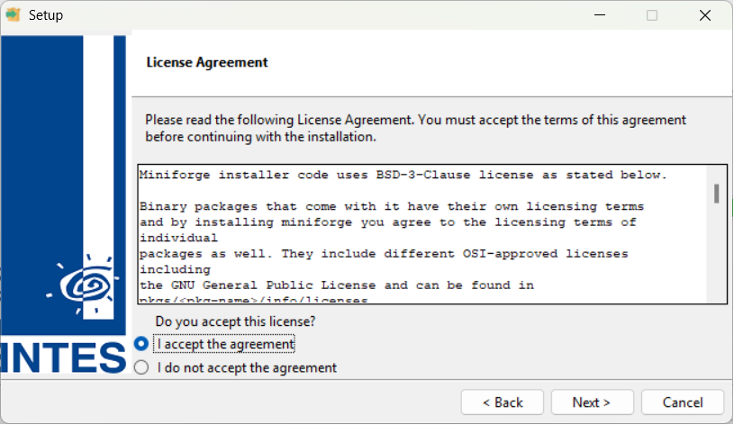
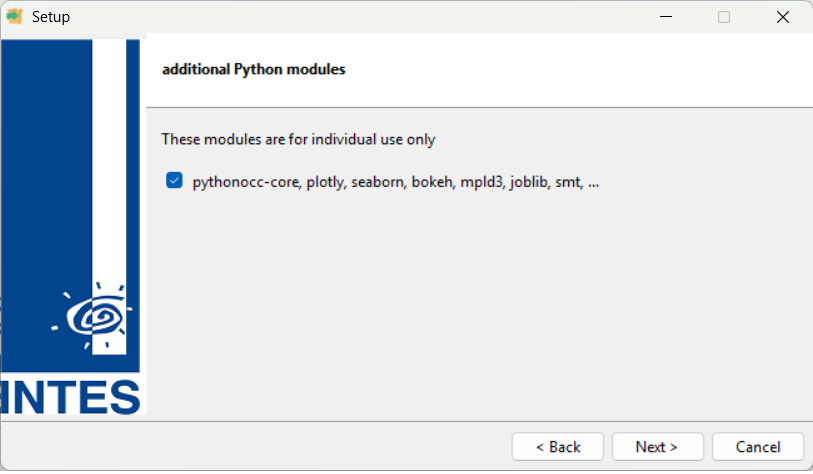
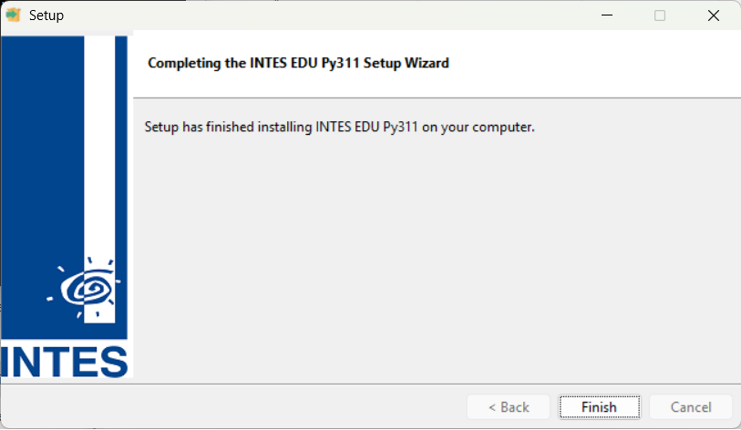

# Windows

### Required Files

Before you start the installation process, make sure that the following files are available on the computer.

Double-click on the Base Installer to start the installation.

### License Agreement

### License file

### Solver settings

### pyINTES License Agreement

### Additional Python modules

### Installation completed

$$\textrm{\color{red}{The installation process is completed after approx. 20 minutes.}}$$ Thank you for your patience.

# Linux

