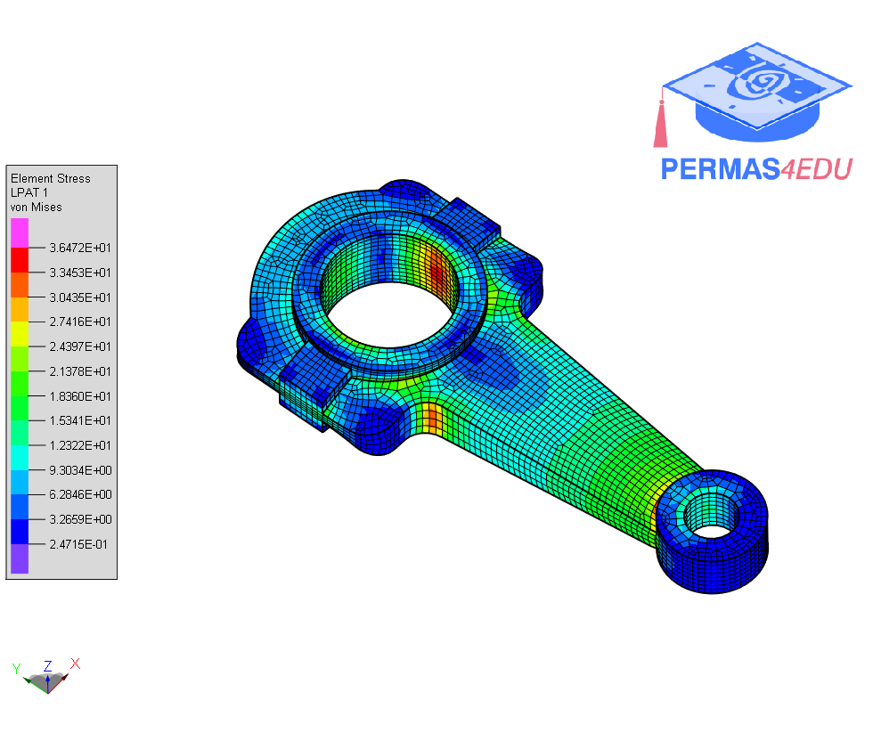

The example is taken from [A computationally efficient isoparametric tangled finite element
method for handling inverted quadrilateral and hexahedral elements](https://doi.org/10.1016/j.cma.2023.115897)

