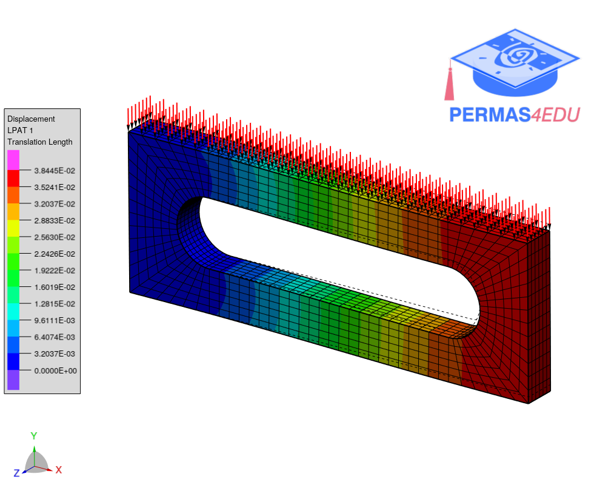

***
[⬅️](../001/README.md "Previous example")
[➡️](../003/README.md "Next example")
***
The example is taken from [A Solution Procedure to Improve 3D Solid Finite Element Analysis with an Enrichment Scheme](http://dx.doi.org/10.3390/app13127114)

