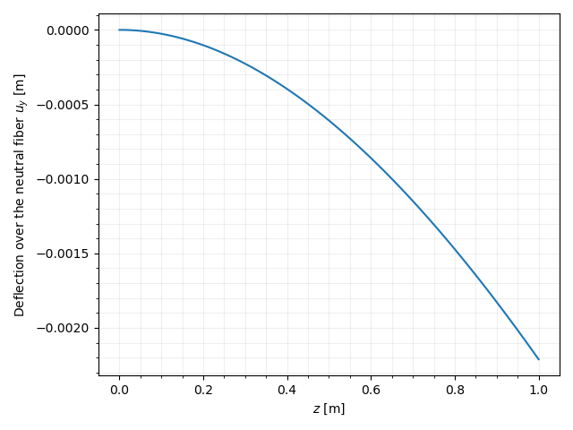

***
[⬅️](../002/README.md "Previous example")
[➡️](../004/README.md "Next example")
***

The example is adapted from an [I beam under remote force](https://www.simscale.com/docs/validation-cases/i-beam-under-remote-force/)

