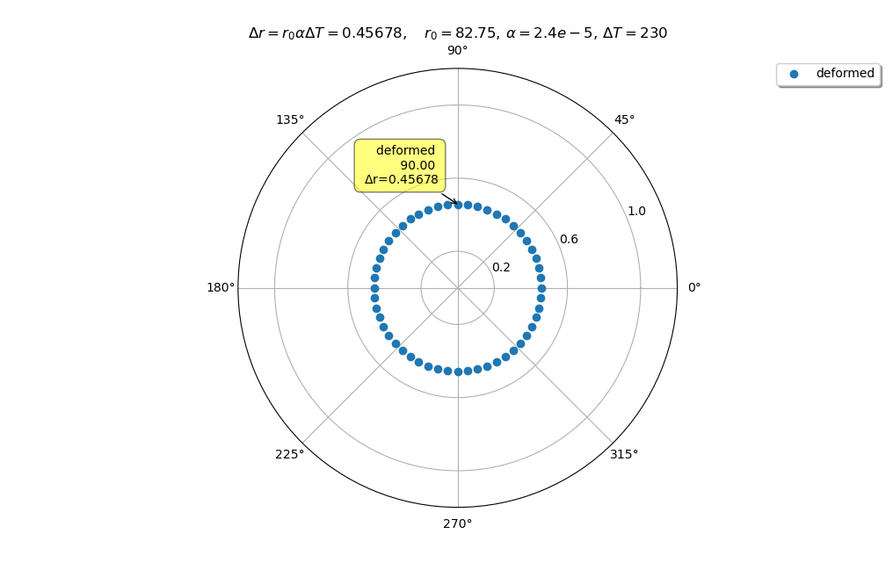
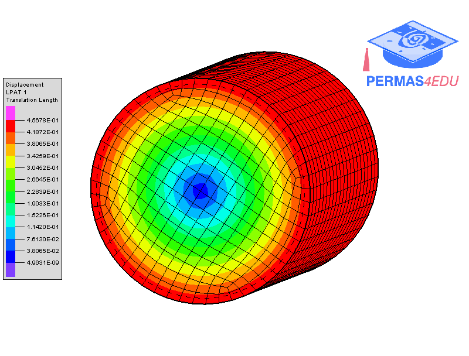

The example is motivated by a [discussion](https://www.researchgate.net/post/Why_does_the_thermal_expansion_change_with_varying_length_of_cylinder_in_Abaqus) on Researchgate.
Thanks to David Forrestad Swensen for sharing the underlying finite element model.

