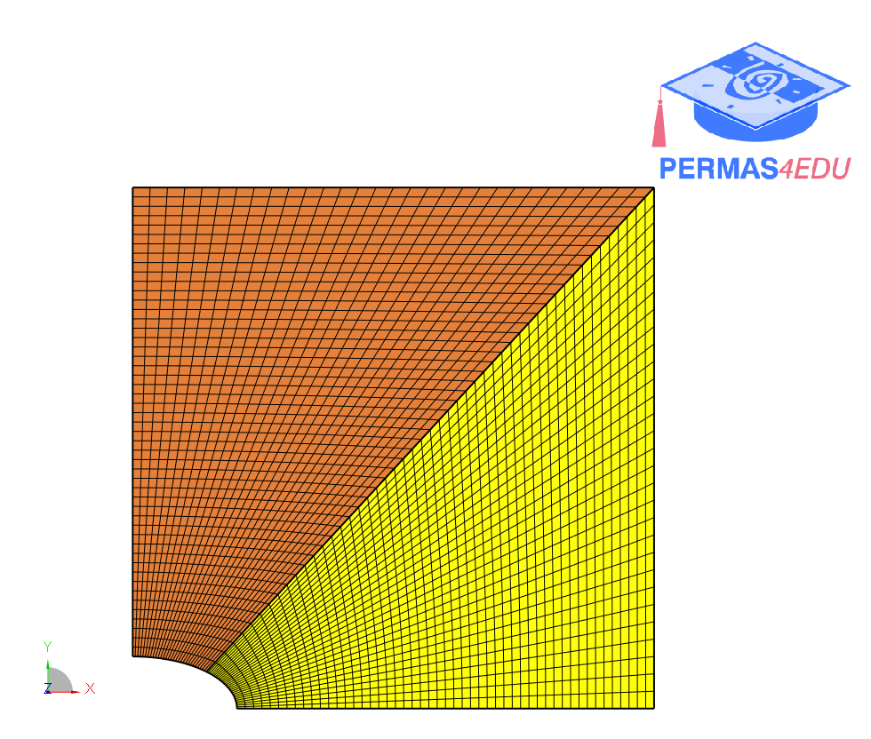

***
[⬅️](../006/README.md "Previous example")
[➡️](../008/README.md "Next example")
***

The example is adapted from [Analysis of Stress and Strain Concentrations Around an Elliptical Hole Via Finite Element Method and Response Surface Methodology](https://doi.org/10.58491/2735-4202.3175)

