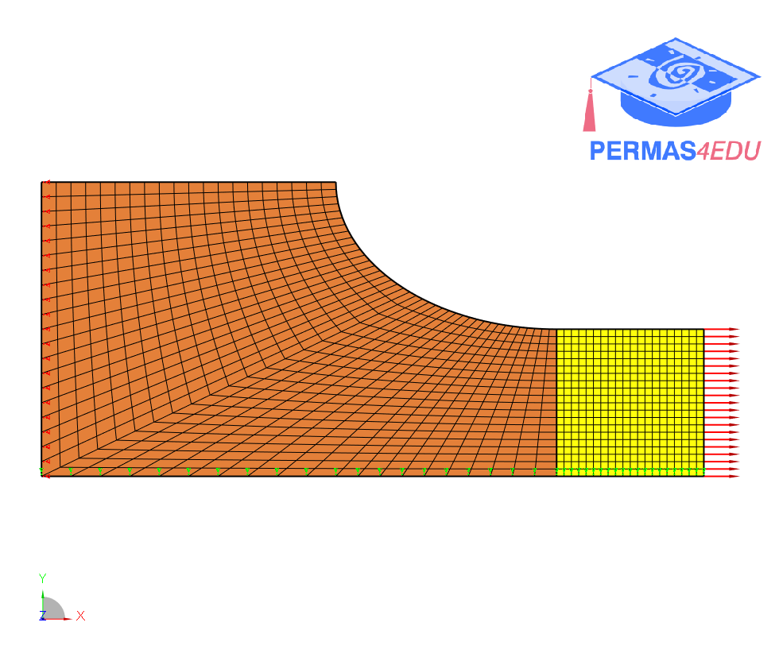

The example is taken from [Accurate and efficient boundary method for isogeometric shape design sensitivity analysis considering tangential divergence of non-smooth boundary](http://dx.doi.org/10.21203/rs.3.rs-3838261/v1)

