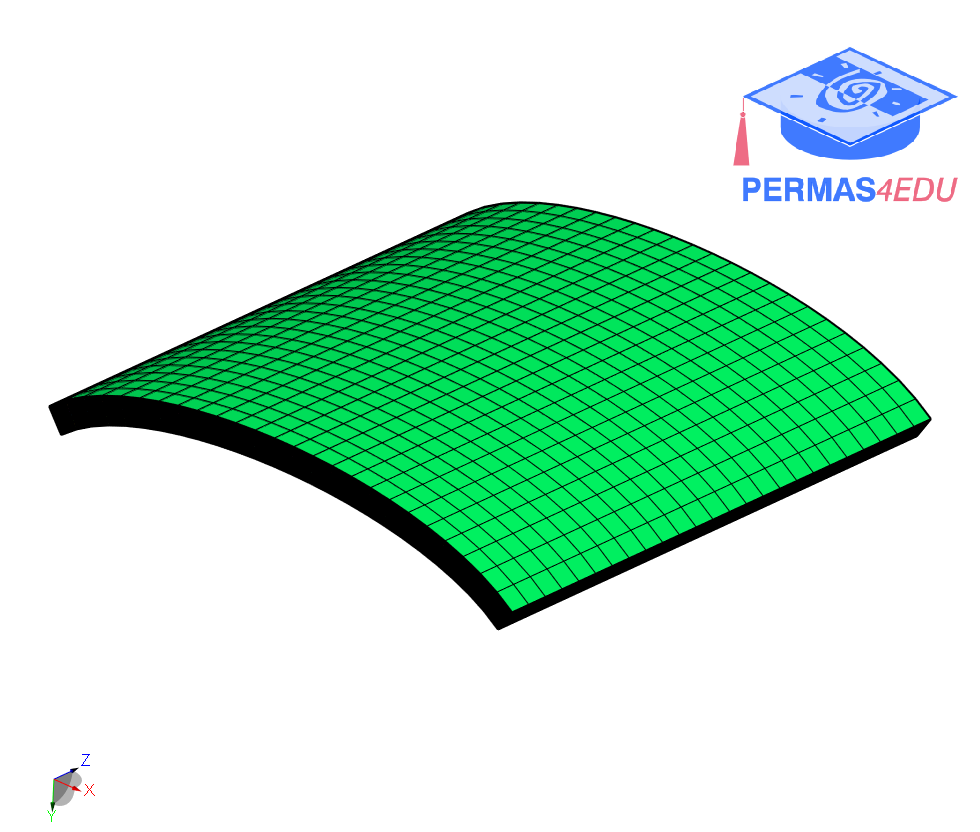
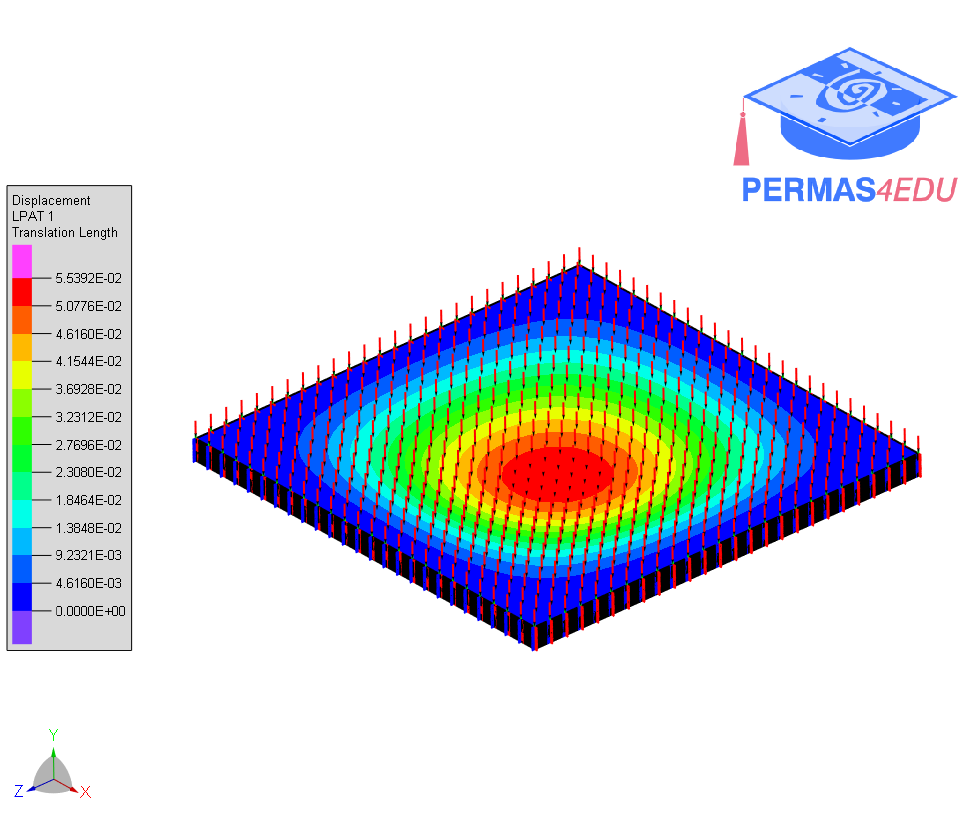

***
[⬅️](../012/README.md "Previous example")
[➡️](../014/README.md "Next example")
***

The examples were kindly provided by Bhakti Malve and Subhankar Chakraborty. Their support is greatly appreciated.
See also [Modelling and Simulation of Composite Structure Using Ansys Composite PrePost (ACP) Tool](https://www.springerprofessional.de/en/modelling-and-simulation-of-composite-structure-using-ansys-comp/27037378)

