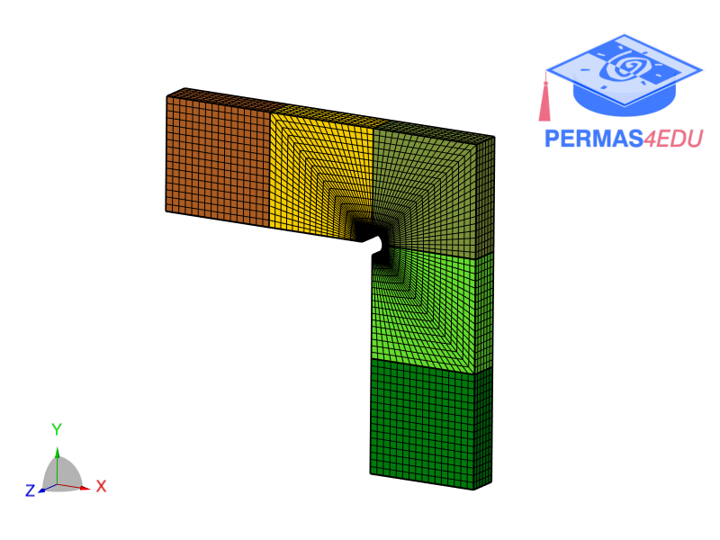
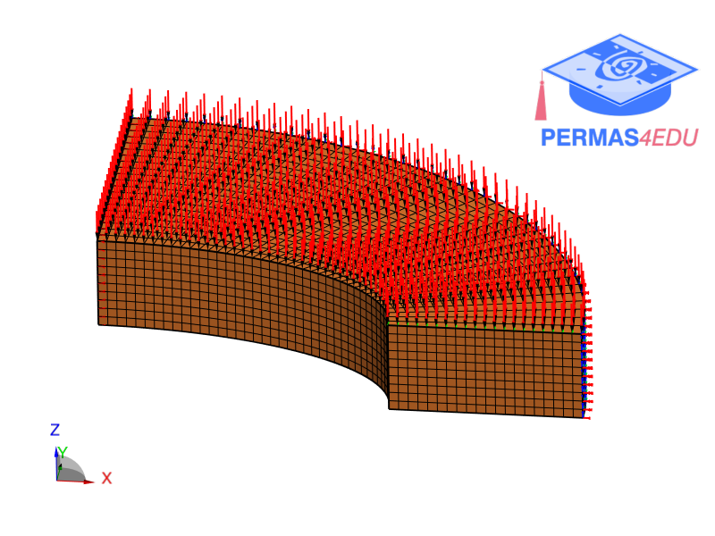

***
[⬅️](../019/README.md "Previous example")
[➡️](../021/README.md "Next example")
***

The examples are adapted from [Accelerated segregated finite volume solvers for linear elastostatics using machine learning](https://doi.org/10.1016/j.advengsoft.2024.103763)

