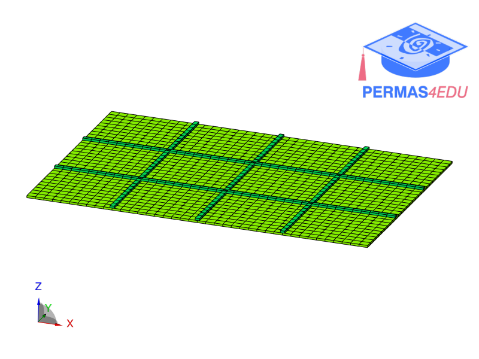
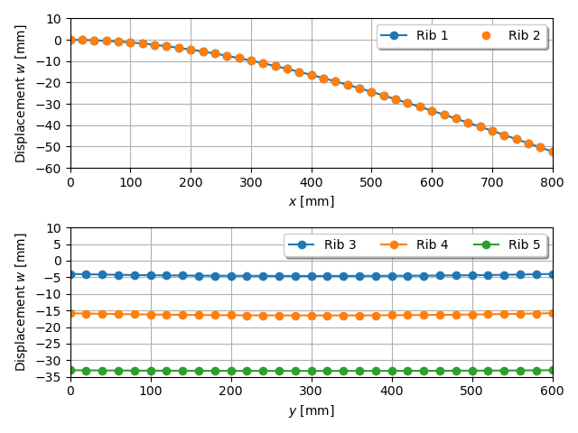

***
[⬅️](../020/README.md "Previous example")
[➡️](../022/README.md "Next example")
***

The example is adapted from [Inverse beam-shell elements for full-field displacement reconstruction of stiffened panel structures](https://doi.org/10.1016/j.finel.2024.104235)

