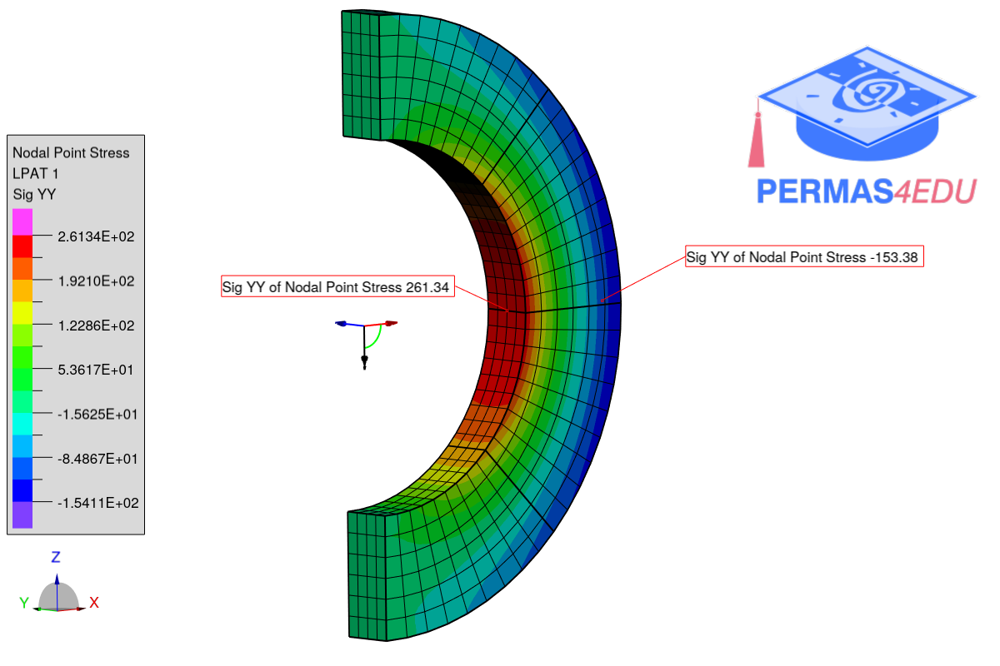
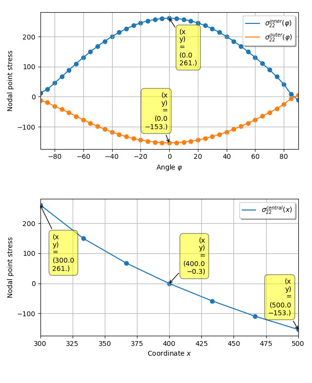

The example is adapted from a [LinkedIn quiz](https://www.linkedin.com/posts/claudio-gianini-7677796_femquiz-ingegneriastrutturalecomputazionale-activity-7295397861968474112-NSTg?utm_source=share&utm_medium=member_desktop&rcm=ACoAAAKPHp0BbZDYvs6O4FWW34in8GbmY8ZMl7Q).

