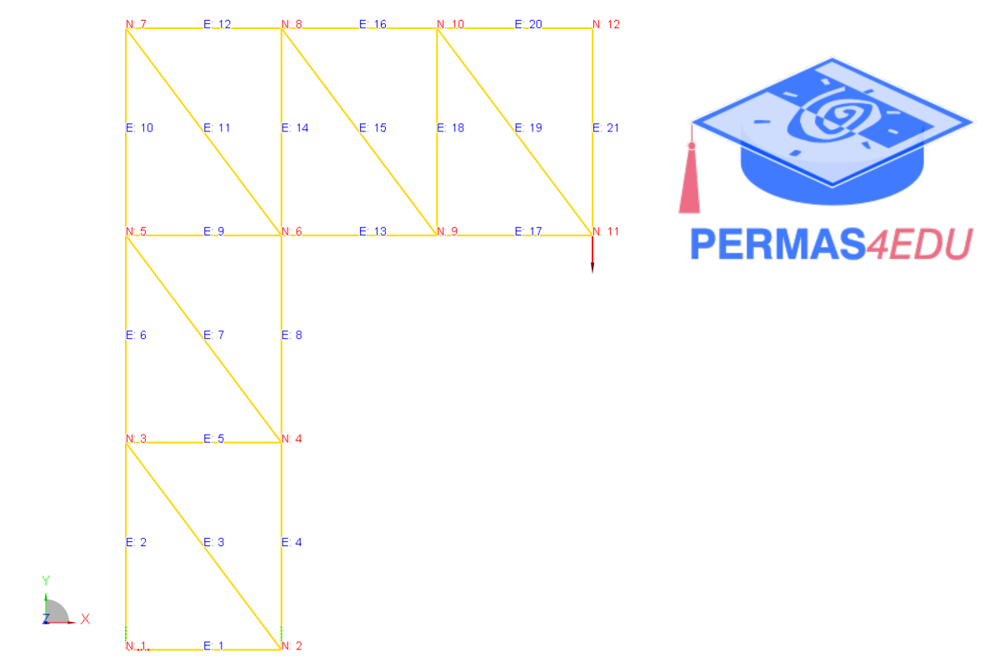
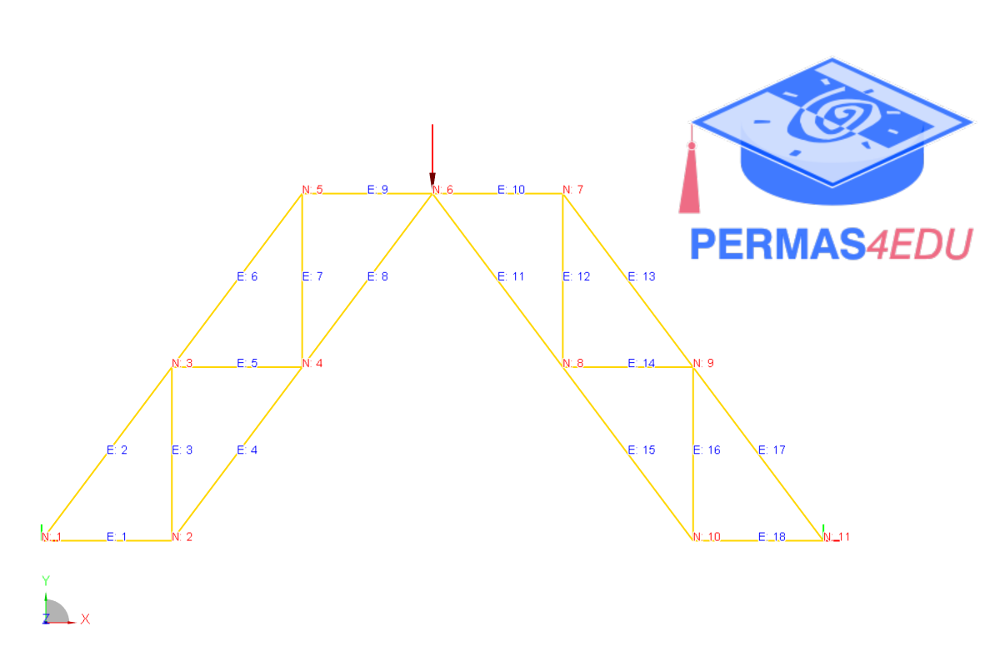

***
[⬅️](../023/README.md "Previous example")
[➡️](../025/README.md "Next example")
***

The examples are adapted from [Deriving analytical solutions using symbolic matrix structural analysis: Part 2 – Plane trusses](https://doi.org/10.1016/j.heliyon.2025.e42372)

### Example 4

### Example 5

