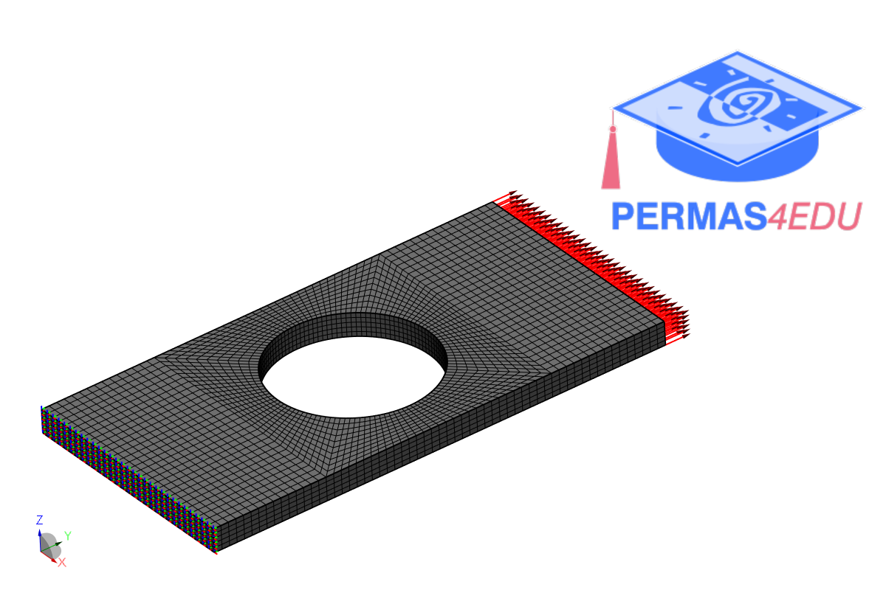

***
[⬅️](../025/README.md "Previous example")
[➡️](../027/README.md "Next example")
***

The example is adapted from [Data Completion, Model Correction and Enrichment Based on Sparse Identification and Data Assimilation](https://doi.org/10.3390/app12157458)

