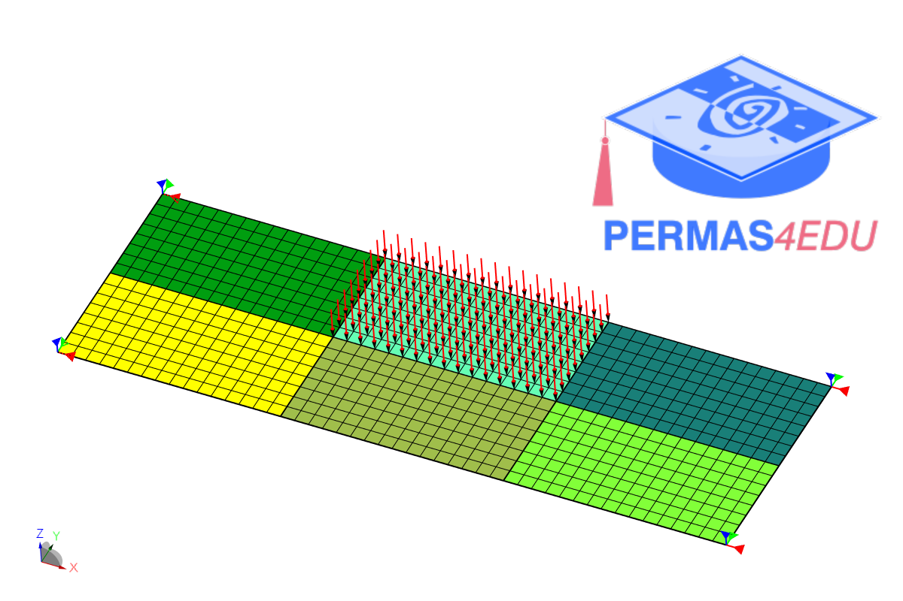

***
[⬅️](../026/README.md "Previous example")
[➡️](../028/README.md "Next example")
***

The example is adapted from [Stochastic static finite element model updating using the Bayesian method integrating homotopy surrogate model](https://doi.org/10.1016/j.compstruc.2025.107769)

