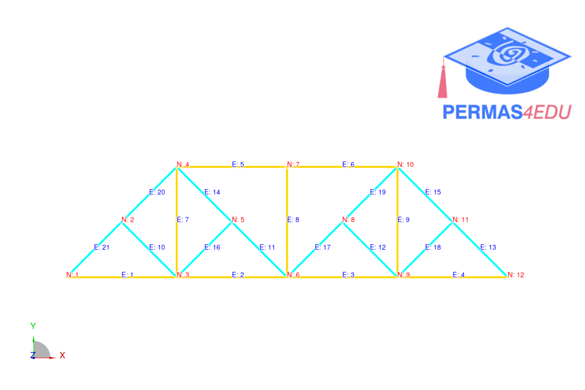
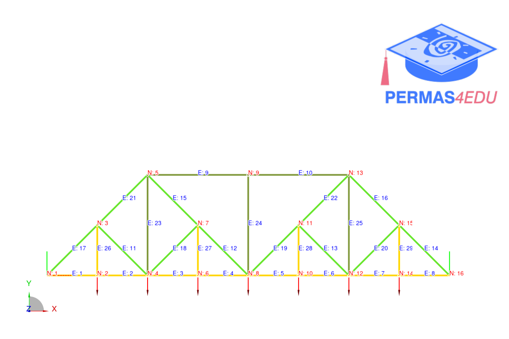

***
[⬅️](../033/README.md "Previous example")
[➡️](../035/README.md "Next example")
***

The example is taken from a recent [LinkedIn post](https://www.linkedin.com/posts/lonny-thompson_fea-of-the-baltimore-truss-bridge-activity-7372990702432968704-zgvo?utm_source=share&utm_medium=member_desktop&rcm=ACoAAAKPHp0BbZDYvs6O4FWW34in8GbmY8ZMl7Q).

