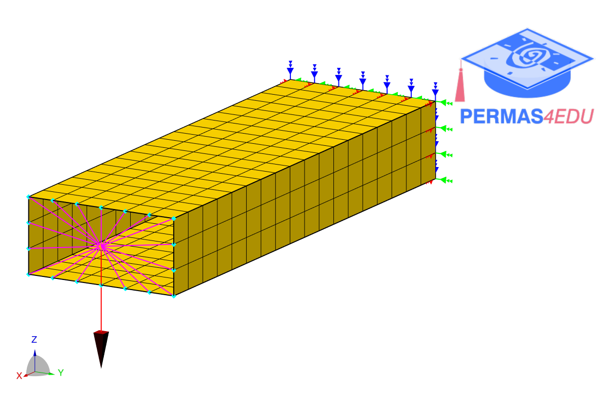
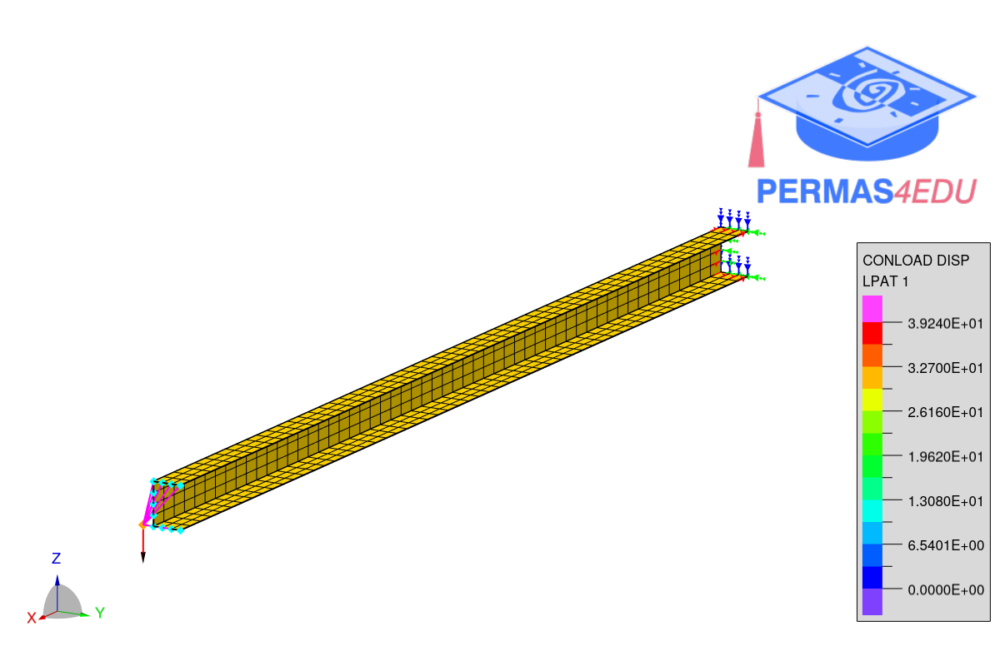

***
[⬅️](../035/README.md "Previous example")
[➡️](../README.md "Go up one directory level")
***

The examples are adapted from [A new Single Sensor Based iFEM formulation for shape-sensing of thin-walled structures instrumented with single-sided sensor configurations: Formulation, numerical assessment, and experimental validation
](https://doi.org/10.1016/j.ymssp.2025.112700)

### Wingbox model

### Stringer model

