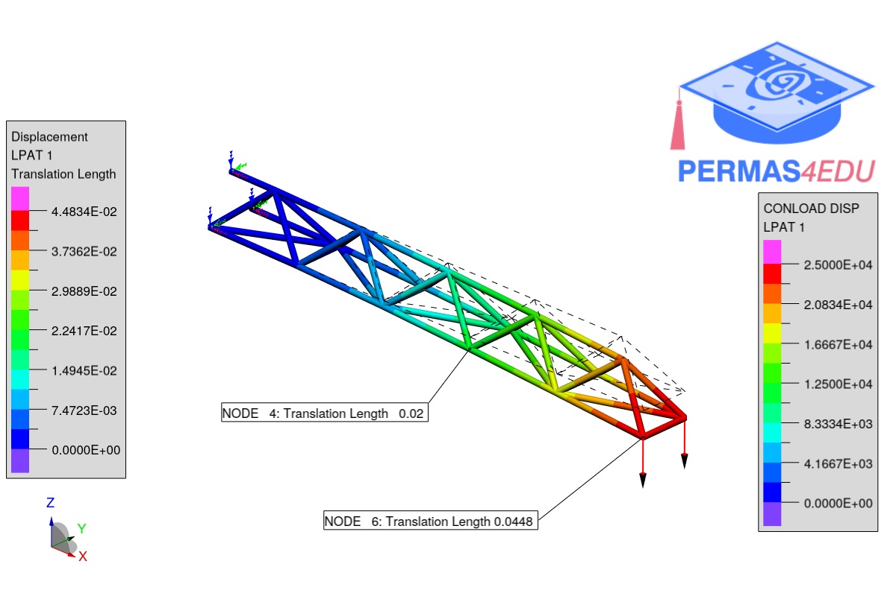

The example is adapted from [An Improved Strain Energy-Based Optimality Criteria Method for Weight-Optimal Sizing of Hyperstatic Structures under Frequency, Buckling, or Displacement Constraints](https://doi.org/10.1142/S0219455427500593)

Thanks to Agathoklis Giaralis for sharing the  corresponding SAP2000 model. His support is greatly appreciated.

