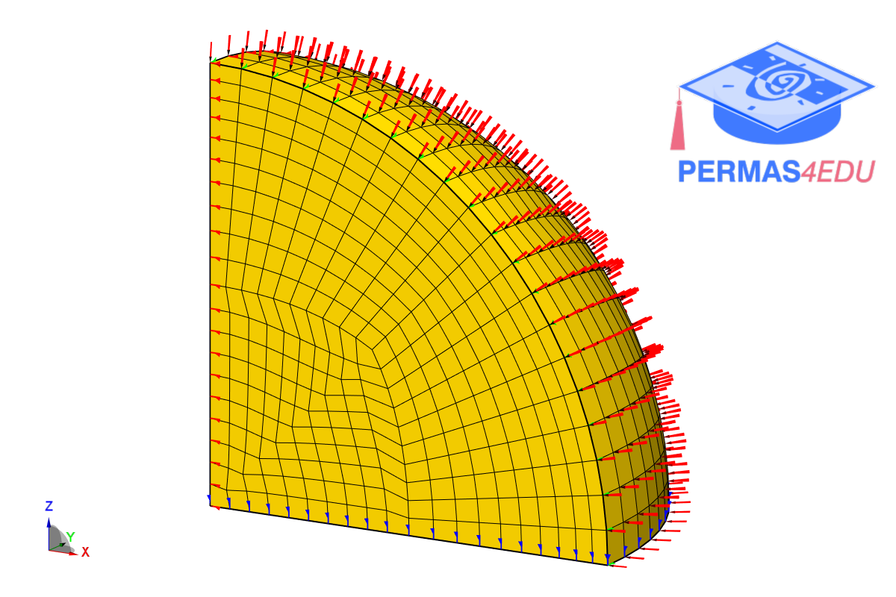

***
[⬅️](../038/README.md "Previous example")
[➡️](../040/README.md "Next example")
***

The examples are adapted from [Mesh-free energy element method for three-dimensional static analysis of structures with complex geometries](https://doi.org/10.1016/j.compstruc.2025.107889)

### Sphere

