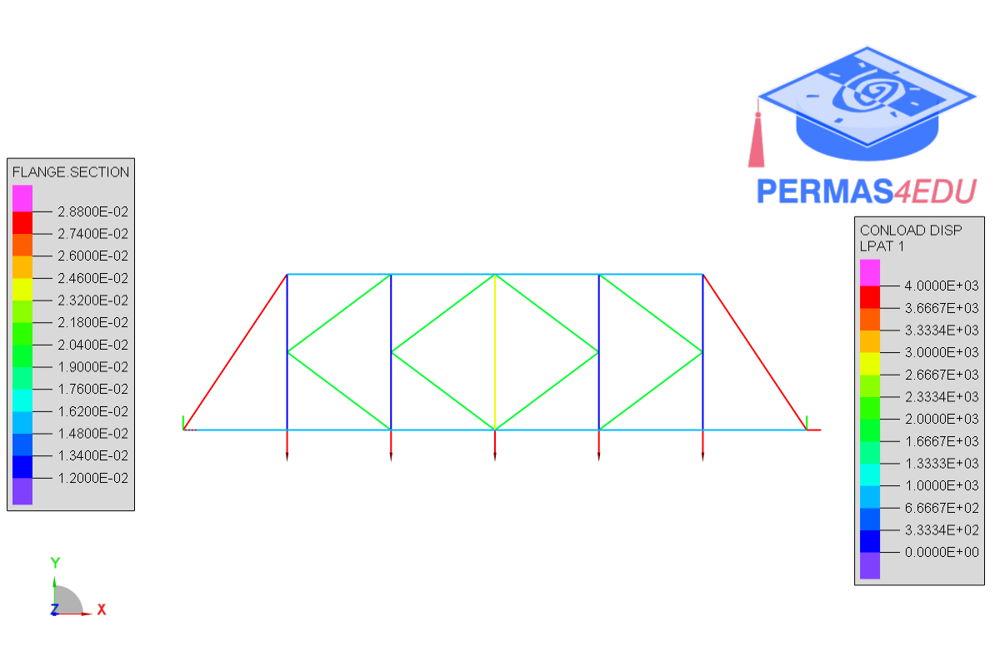
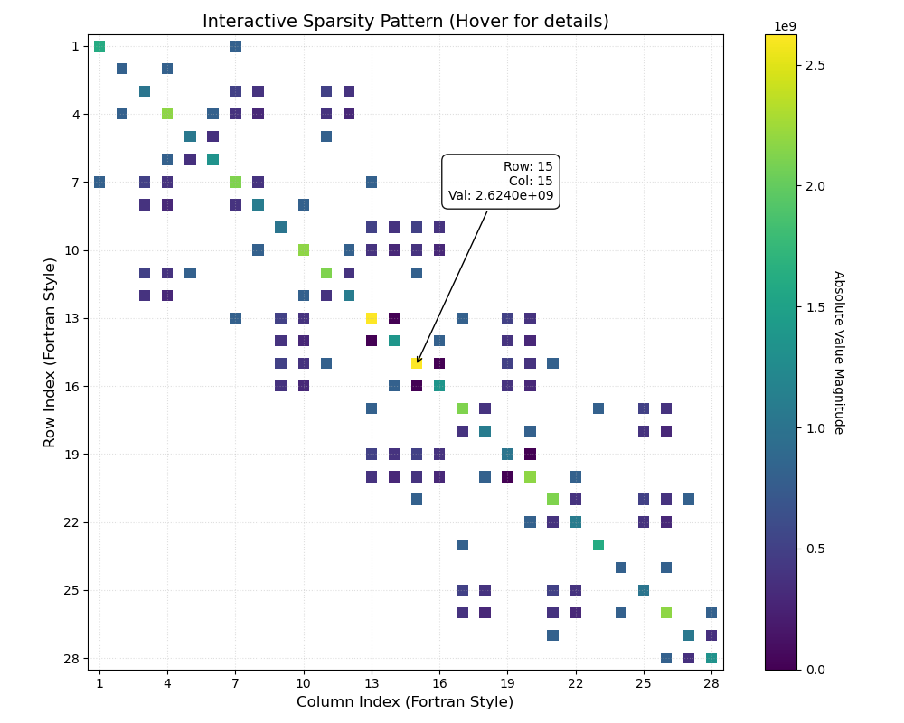

***
[⬅️](../040/README.md "Previous example")
[➡️](../README.md "Go up one directory level")
***

The example is adapted from [LinkedIn](https://www.linkedin.com/posts/lonny-thompson_finite-element-analysis-of-a-k-truss-bridge-activity-7430230176354959360-iVbF?utm_source=share&utm_medium=member_desktop&rcm=ACoAAAKPHp0BbZDYvs6O4FWW34in8GbmY8ZMl7Q). Thanks to Lonny Thompson for sharing.

