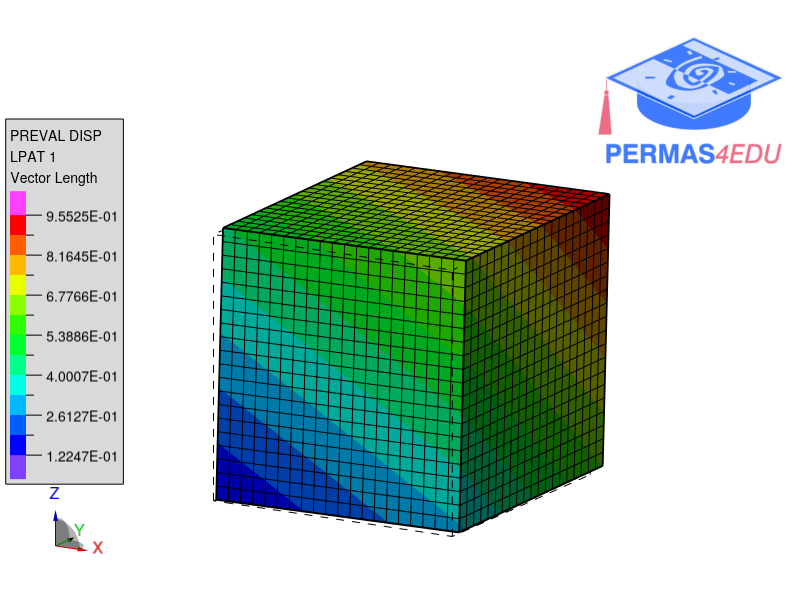

***
[⬅️](../043/README.md "Previous example")
[➡️](../045/README.md "Next example")
***
The example is adapted from [On the Performance and Convergence of PINNs for Problems in Linear Elasticity](https://doi.org/10.1002/pamm.70113)

