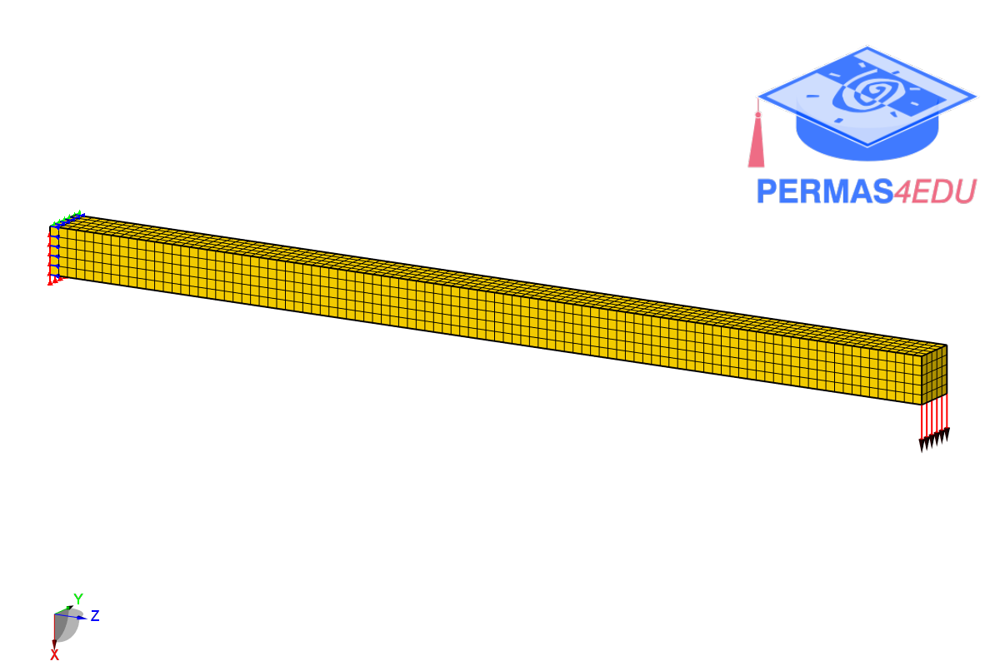

***
[⬅️](../045/README.md "Previous example")
[➡️](../README.md "Go up one directory level")
***
The example is adapted from [Solid Mechanics Segregated Solver Acceleration With Jacobian-Free Newton-Krylov](https://doi.org/10.1002/nme.70368)

