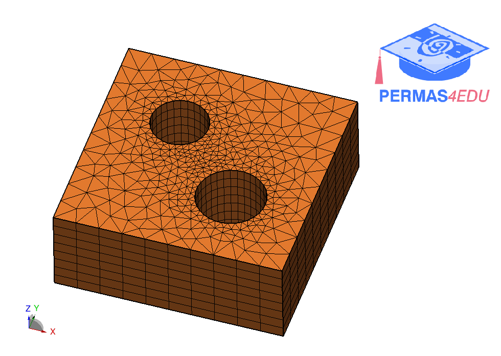

The examples are taken from [A general mesh smoothing method for finite elements](https://doi.org/10.1016/j.finel.2019.01.010)

Thanks to Raul Durand for sharing the meshes in .vtk format. His support is greatly appreciated.

