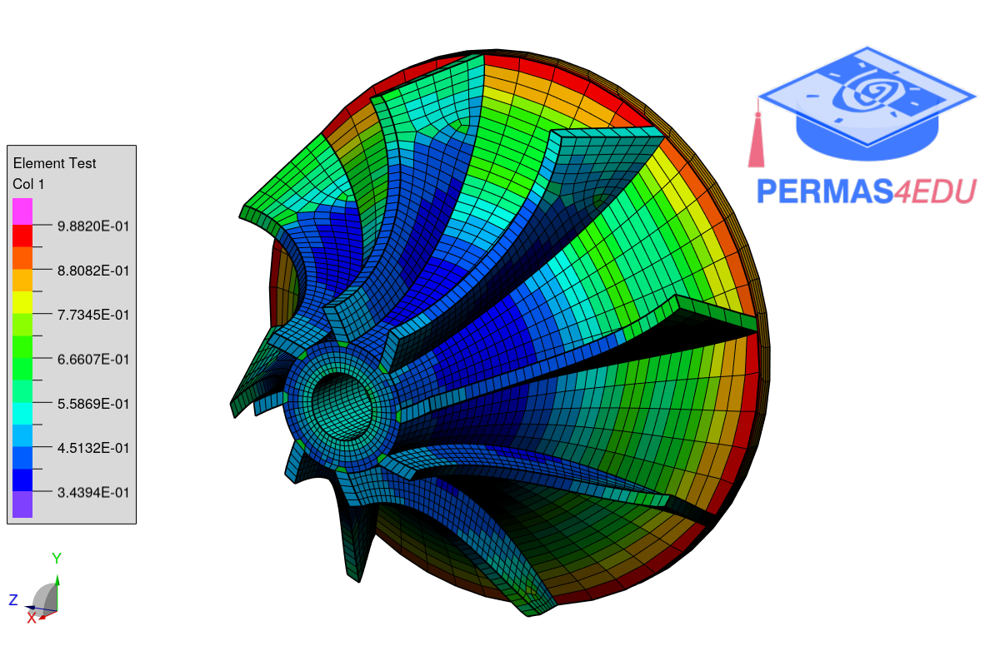

***
[⬅️](../002/README.md "Previous example")
[➡️](../README.md "Go up one directory level")
***

The example is adapted from [Fast and Robust Hexahedral Mesh Optimization via Augmented Lagrangian, L-BFGS, and Line Search](https://doi.org/10.48550/arXiv.2410.11656)

