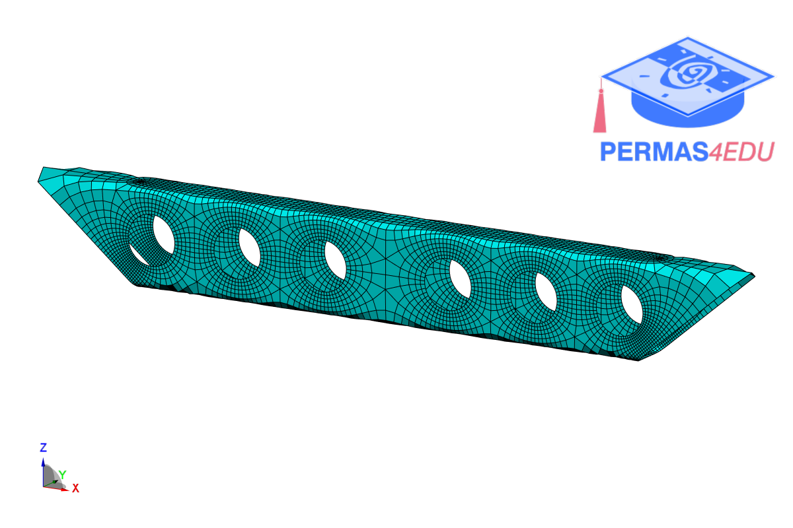

***
[⬅️](../003/README.md "Previous example")
[➡️](../README.md "Go up one directory level")
***

The examples are adapted from [Quadrilateral mesh generation based on foliation and meromorphic quadratic differential](https://doi.org/10.1016/j.cad.2025.103953).
Thanks to Hao Wang and Xiaopeng Zheng for sharing the mesh files in different formats. Their support is greatly appreciated.

