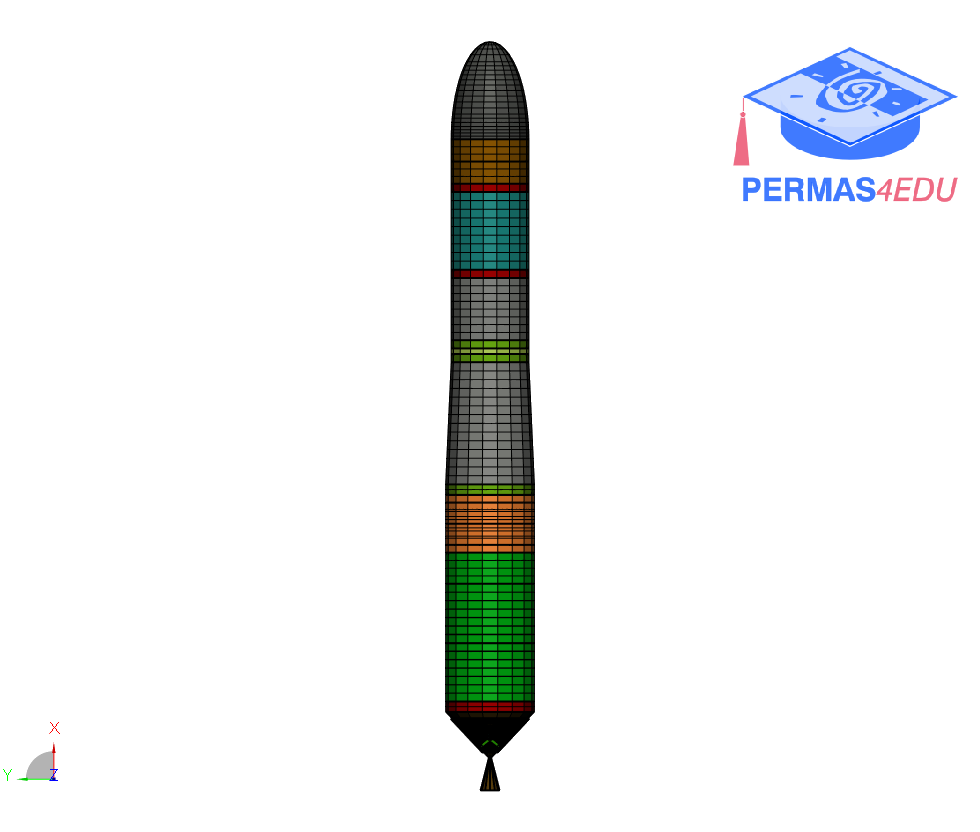

## Acknowledgement

Thanks to my colleagues from [INTES France](https://www.permas.fr) for providing the fast launcher model. Their support is greatly appreciated.
The launcher built in this tutorial is divided into 2 propogol liquid stages (LOx/LH2). Its architecture is single-body, that is to say without booster boosters (such as the Ariane 5 EAPs).

## Model Description

