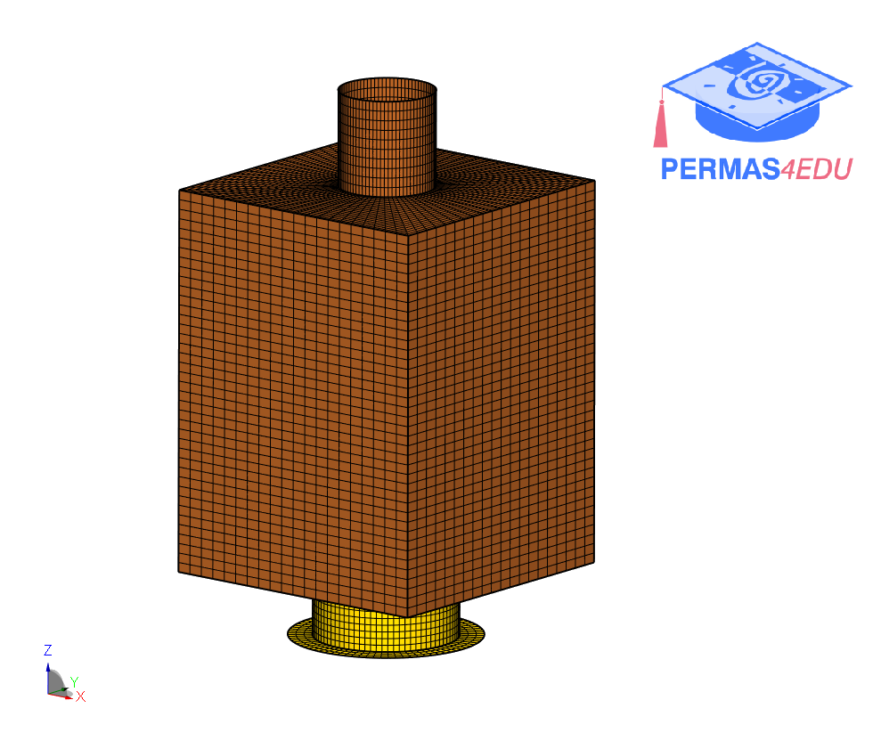

The example is taken from [Study the effect of tri-axis vibration testing over single-axis vibration testing on a satellite](https://doi.org/10.1109/AERO53065.2022.9843382)

Thanks to Narendra Nath for sharing the Nastran model. His support is greatly appreciated.

