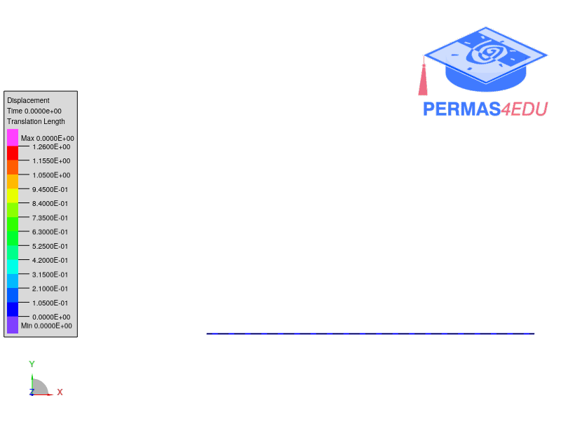

The example is based on a [Roll Up Beam](https://github.com/KratosMultiphysics/Examples/tree/master/structural_mechanics/validation/beam_roll_up)

Reference: Krenk, S. (2009) Non-linear modeling and analysis of solids and structures. Cambridge: Cambridge University Press. pp. 114--115
