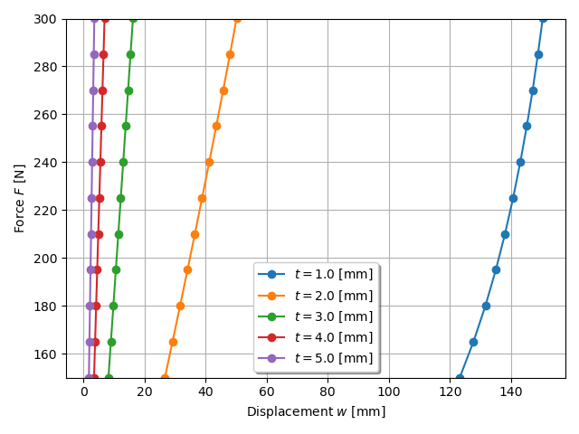

***
[⬅️](../003/README.md "Previous example")
[➡️](../README.md "Go up one directory level")
***

The example is adapted from [A surrogate model based on NURBS entities for engineering problems](http://dx.doi.org/10.4203/ccc.5.1.10)

Thanks to Bruno Vuillod for private communication.

Remark: Material nonlinearities are neglected for convenience.

