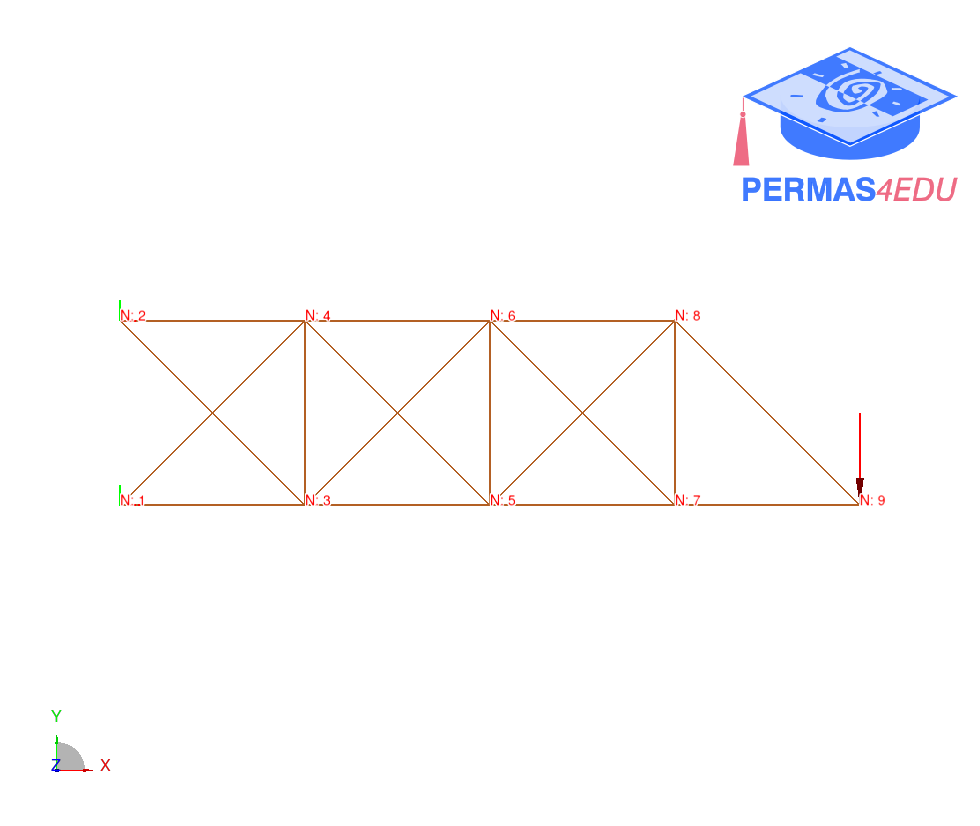

***
[⬅️](../001/README.md "Previous example")
[➡️](../003/README.md "Next example")
***

The example is taken from [Physics‑informed neural energy‑force network: a unified solver‑free numerical simulation for structural optimization](https://doi.org/10.1007/s00366-022-01760-0)

