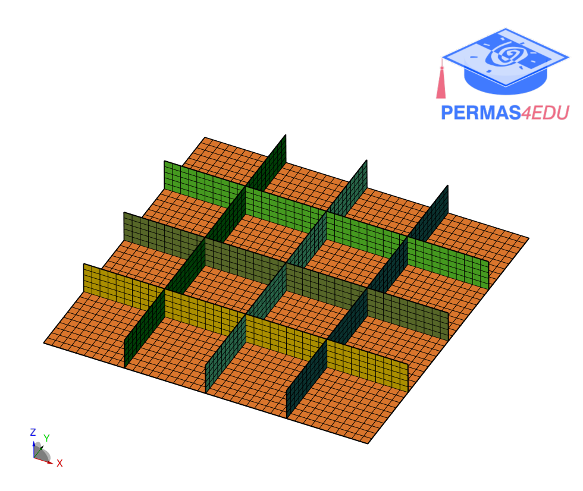

The example is adapted from [Concurrent stacking sequence and layout optimization of stiffened composite plates using a spectral element method and an index-based optimization technique](http://dx.doi.org/10.1016/j.compstruct.2023.117698)

