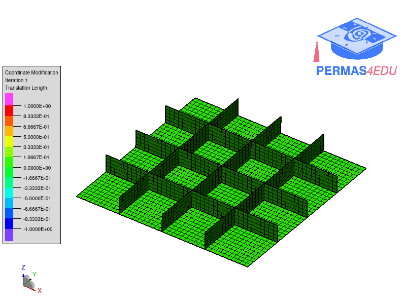

The example is adapted from [Concurrent stacking sequence and layout optimization of stiffened composite plates using a spectral element method and an index-based optimization technique](http://dx.doi.org/10.1016/j.compstruct.2023.117698)

The layout of the stiffeners was sought while the stacking sequence for both the base plate and the stiffeners were fixed.

The animated gif illustrates the movement of the stiffeners during optimization.

